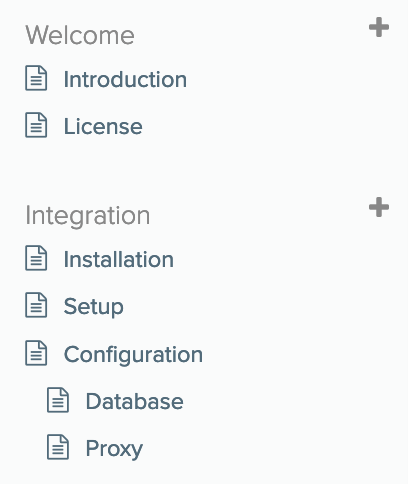

# readme.com Sync Tool

This is a CLI tool that synchronizes markdown files from a local directory (typically in a git repo) to https://readme.com.

## Usage

`npx readme-sync --apiKey <key> --version <version> --docs <dir>`

or, to just validate the files:

`npx readme-sync --apiKey <key> --version <version> --docs <dir> --validateOnly`

## Expected Directory Structure

Top level folders are mapped to categories. Second and third level `.md` files are synced as docs. Readme only supports two levels of nesting (Category > Parent Doc > Child Doc). If you want a doc with children, create a folder with the doc name, and create an `index.md` file inside it.

The folder and file names are turned into the slugs.

Example:

```
docs
├── Welcome
│   ├── 00 - Introduction.md
│   └── 10 - License.md
└── Integration
    ├── 00 - Installation.md
    ├── 10 - Setup.md
    └── Configuration
        ├── index.md
        ├── 00 - Database.md
        └── 10 - Proxy.md
```

Becomes



## File Contents

Markdown, with front matter:

```markdown
---
title: "Installation"
excerpt: "How to Install Arch Linux" # optional
hidden: true # optional
---

# Installation

...
```

## Limitations

- Categories cannot yet be created automatically. They must be manually created in Readme. You can fetch the existing category slugs with
```bash
curl 'https://dash.readme.io/api/v1/categories?perPage=100' -u '<your_readme_api_key>': -H 'x-readme-version: <your_docs_version>'
```
Note that category slugs may differ from the category titles you see on dash.readme.io, so this API call is a good way to troubleshoot the error message "can't create categories."

## Syncing Behavior

- If you have a category on readme.com that you don't have locally, the category and its contents will remain untouched on readme.com.
- If you have a doc on readme.com that you don't have locally (but you have the category), it will be deleted from readme.com.
- If you have a doc locally that is not on readme.com, it will be uploaded to readme.com
- If you try to create two docs with the same name, you'll get an error about document slugs not being unique, even if the files are in separate categories.
- The publishing order is alphanumeric. You can force ordering by prefixing your files with `01 - `, `02 -`, etc. Then, these ordered pages go first in the table of contents (stripped of their `01 - `, `02 -` ordering prefixes).

## Development

1. `git clone https://github.com/flowcommerce/readme-sync`
1. `nvm install`
1. `npm install`
1. `npx ts-node sync/index.ts --apiKey <key> --version <version> --docs <dir>`
